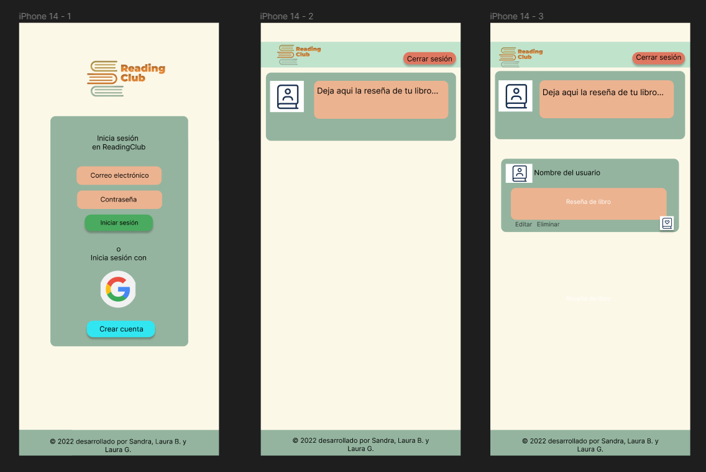
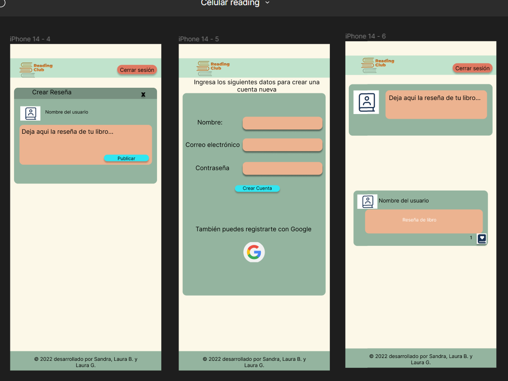

# Creando una Red Social

##Desarrollado por Laura Garduño, Laura Buitrago y Sandra Corral.

## Índice

* [1. Introducción al proyecto](#1-Introducción-al-proyecto)
* [2. Resumen del proyecto](#2-resumen-del-proyecto)
* [3. Prototipos](#3-objetivos-de-aprendizaje)
* [4. Historias de usuario](#4-historias-de-usuario)
* [5. Comportamiento UI](#5-comportamiento-UI)
* [6. Producto final](#6-producto-final)
* [7. Pruebas unitarias](#7-pruebas-unitarias)

## 1. Introducción al proyecto:

En este proyecto nos propusimos desarrollar una red social para los amantes de los libros. Creamos un espacio para que los usuarios creen su perfil y puedan compartir reseñas de los libros que han leído y así disfrutar de dar y responder a diferentes opiniones. https://dev-002-social-network-readingclub.vercel.app/

## 2. Resumen del proyecto:

En este proyecto construimos una red social con la siguiente información:

* Desarrollamos una SPA que cuenta con los conceptos responsive. 
* Implementamos un servicio externo a través de Firebase.
* Creamos e implementamos pruebas unitarias.

## 3. Prototipos:

Creamos prototipos de baja y de alta fidelidad utilizando Figma y basándonos en las historias de usuario logramos establecer el diseño de la red social.
Obtuvimos feedback de pares y coaches hasta que consideramos que la página estaba lista para desarrollarla.

### Prototipo de baja fidelidad

### Prototipo de alta fidelidad

## 4. Historias de usuario:

* Historia de usuario 1: Yo como fanática de los libros quiero crear una cuenta en ReadingClub para conocer y dar diferentes opiniones de libros y así compartir reseñas de libros y conocer las opiniones de otras personas.
* Historia de usuario 2: Yo como usuario de ReadingClub quiero publicar para dar mi opinión acerca de diferentes libros.
* Historia de usuario 3: Yo como usuario que ya publicó una reseña quiero leer las diferentes reseñas de otros usuarios en la plataforma.
* Historia de usuario 4: Yo como usuario que ya está logeado en la plataforma quiero poder cerrar sesión para que otros usuarios puedan ingresar para conocer nuevos libros.

## 5. Comportamiento UI

### Creación de cuenta de usuario: 
 
* Ingreso a través de data almacenada en Firebase.
* Creación de cuentas de usuario con correo y contraseña y a través de cuentas de Google.

### Dashboard:

* Las publicaciones en el muro son en tiempo real.
* Se pueden editar las publicaciones propias.
* Se puede dar like a las publicaciones y ver el conteo de likes.
* Se pueden eliminar las publicaciones propias y se pide confirmación para eliminar. 

## 6. Producto final:

## 7. Pruebas unitarias:

