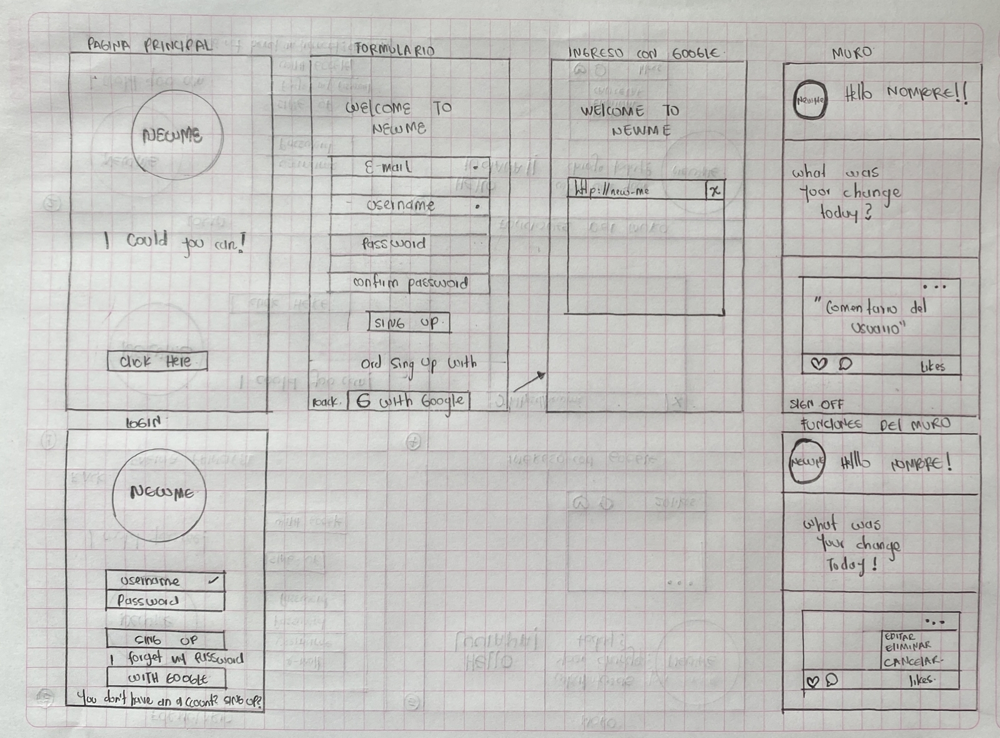
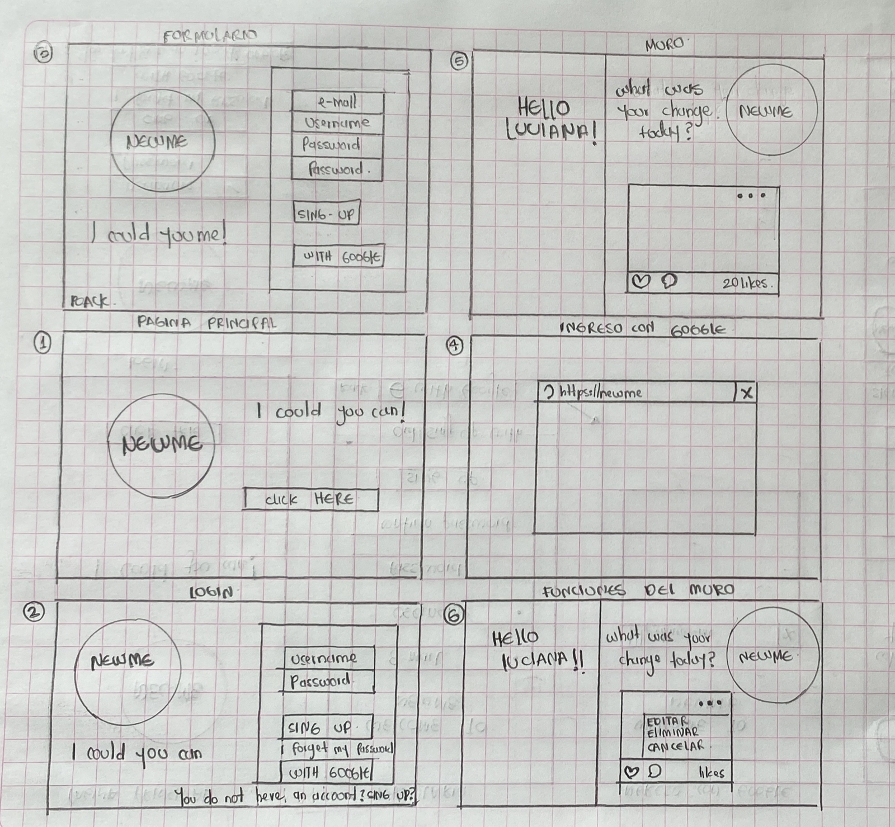
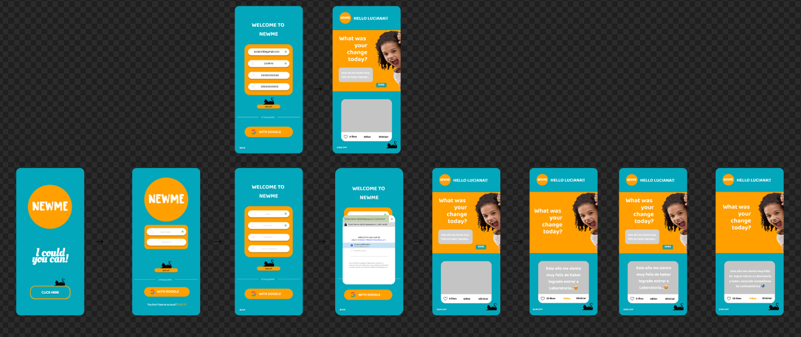
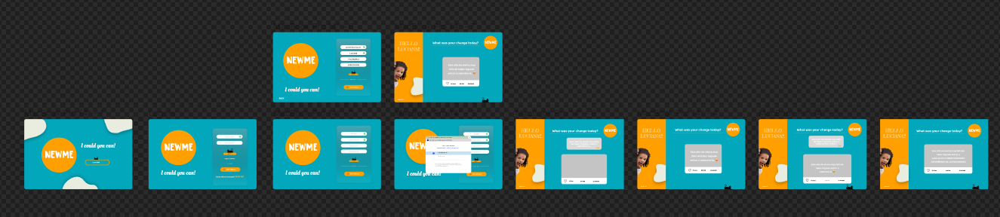

# Proyecto Social Network
# **NEWME**

## Índice

* [1. Definición del producto](#1-definición-del-producto)
* [2. Principales usuarios](#2-princiaples-usuarios)
* [3. Objetivos de los usuarios en relación al producto](#3-objetivos-producto)
* [4. Qué problema resuelve el producto / para qué le servirá a estos usuarios](#4-problemas-resuelve)
* [5. Prototipo](#5-prototipo)

***

## **1.Definición del producto**

Nuestra red social es una plataforma Web y Mobile para que lxs usuarixs muestren sus cambios, esos cambios que le llenan de orgullo o cambios que representan una parte muy importante dentro de sus vidas; Nada como contarle a otrxs personas tus logros y que celebren contigo

Video de guía, o idea: https://trends.google.com/trends/yis/2022/CO/

## **2. Principales Usuarios**

Cualquier persona que desee contarle a su red de amigos, familiares o conocidos los acontecimientos importantes de su vida; Cambios que al día de lo hoy lx hacen sentir diferente o aquella situación que cambio su vida dándole un giro de 180°

## **3. Objetivos del usuario en relación al producto**

- Lograr que el usuario pueda compartir sus cambios o logros
- Permitir que el usurio encuentre una red social donde no tenga miedo de mostrar sus cambios
- Permitir al usuario interactuar con amigos y conocidos.

## **4. Qué problema resuelve el producto / para qué le servirá a estos usuarios**

Permitirá contar sus historias de vida o mostrar los cambios que le han traído felicidad, o algun sentimiento que le ha representado un cambio significativo a su vida.

## **5. Prototipo**

### **5.1 Baja Fidelidad**

 **Movil**

**Desktop**

### **5.2 Alta Fidelidad **

 **Movil**

**Desktop**

### **5.3 DISEÑO FINAL PROYECTO**
